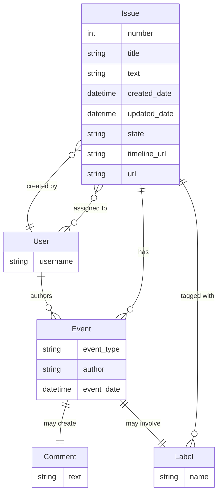
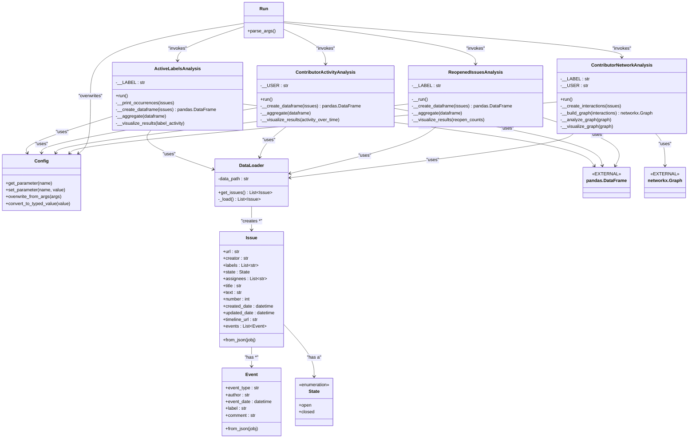

## Milestone 1
- Domain model ERT Diagram
- Domain model Class Diagram

### ERT Diagram: Mermaid Solution
https://mermaid.live/edit#pako:eNp9k89uwyAMxl8FcW5fINdth0m7TbtVqmhxEyT-VGDaRUnefSakRSnRuPH5h_0Zw8DPTgJvOPh3JVovzMEyWp8hRGCT2-_Hkf0E8KxhB372IBAkO_UH_sq5oXAiBNVaAtGtwXGcwY8bWJzJToRN4kucQM8EiralTHeFXSIzO1eqkomInfOhYDmUOOrizRnzII3oWW7mUX2FluoJVPbm9A1K2ux0yJu0FB210ZzIVBEDemVbhgo11Cr8YhElGUFlYPEkj0nYCMer3AgvKQNuqemcVhaO0esq-NSm1cUONUiyFQZe6HxpNQ5JP2J_rf3kGW30ls-Uzp5FHnMb_rnEJ5wnV6Mr83zHDXgjlKSHP7P0zDoggqeZS7iIqDHNeyKUHLvv3p55gz7CjnsX2443F6ED7fJIlr-zqNMfkVMODg

### ERT Diagram: MermaidJS Code

### ERT Diagram: Mermaid Solution
https://mermaid.live/edit#pako:eNrFV9tqGzEQ_RWxUFi3ST7AhICbuKVg8mC30AeDkHfHayWytOjiJA3Jt3ck2Yn24kteWj94Wemc0ZkZaUb7nBWqhGyYFYIZc8NZpdl6Lgn-Pn0i134QDGGyJHYFXJM12JUq4wizVvOFs2DmMlKCEXKt5JJX5DmO-d-XCiytGZoGCzqX-Bwks6Yze0Y2TLgGSG1AP2hugS61WlOmK5P7vxRTKIkoS62i9qmGkgYreWrrpan1hlk2UawEneo9L3EYJdkVGRJjdcsTbowDkw_IhBv7-sO_vSZkKtBg32xr7TDVCJPTorNgoYFZpTvjgi1AGBwOy-DcaxpRyyzg3Mw_k3FcllcSYB_Pciugs5SFR9sZlG69AC-LS9uWi5EvowD_sHydanB1eQThXwWXQPviARuQ9k3_2L-lHoTNcWeUzO_U4q4_6YHUCHwwGvZMZz3mcMfrfhkHfAjp6SZTrdd-7fb4KapDLlPVl5eASQDNLFfy6io9KzXIdFWhDJQto3i8R5KJJ8PN7pw31xsVlm9gErbZGzI9JJRORl_Hk44z2sl80MDVGjcJVUXhtAZZ4NmJR6iJilvHx5QtfTHYgUiN1YaZC39Wv_mJBotVlYYKifkbsWl2w41jgv8BqsE4YU0eckOZ94_bp_5oYxGL1U3p0Ra4Jwi_ZuPpCTH4Z97t_KK-YlK_Lfs9nILfJlCGMvShDOP4f_RPB920UA7rwNHk3YJ9UPr-g-59LKe4ufEUFv4Y9u_sheOipNha61WeggdERnmPF9_9ZDM0XjL6HWnhf19oupB2rp1s1DvstgZiDx1068L4ESXi6lhiF5ppju0iZ4bUghWwUgKbpfcvtd_OcbNMjX__HE9vR5NdjWqJa8bgRCrKnIIIpc-seG3IAq0AyGjzvZYlDf78_Grbc4dknsXcGfJ5nkVknPKg2B88aMV6AbNte40A5gER0lszPSOR4WnOK8yOcLb3qJPxnSSkzMg9VNWOyDxG3aP2GO0E0XsK1RG9B1h7pB5gfCy07ZpzemT7mMcD28dqHaqeqGJJaJl_u2K_h2QL6t1znsLlRt138YeyfoC2JwOnLdSOQoOVnWV4U1ozXuK3Tqgw8wy_aLAbZR5XwpJhc_HWXxCKdz41e5JFNrTawVmmlatW2XDJhMG3eIHdfittR1_-AoDdPrE

### ERT Diagram: MermaidJS Code
